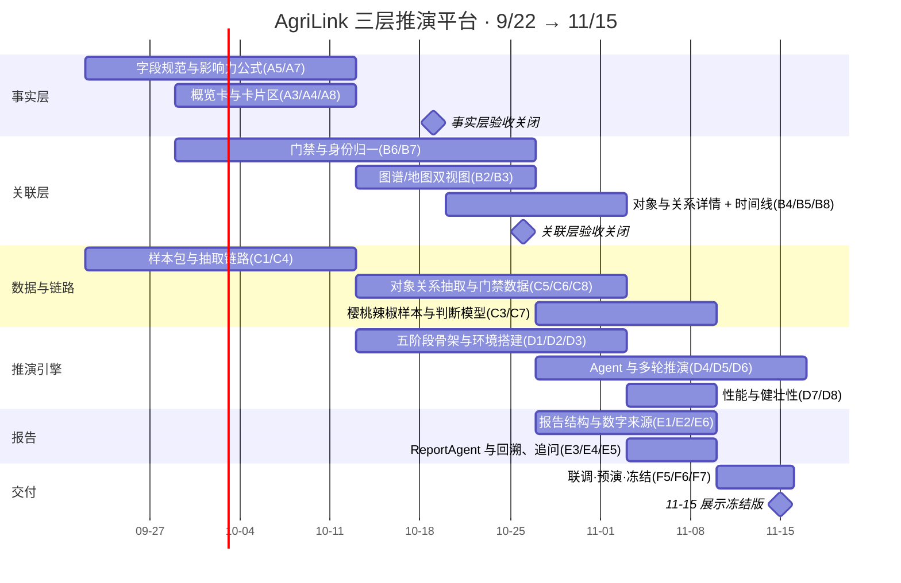

# AgriLink 农链 · 功能拆分与排期（对齐《农业数据三层推演平台产品方案 V1.2》）

> **依据文档**：`UpStarData/Project_Design` → `农产品交易大模型/需求/11 月 15 日农业数据三层推演平台产品方案 V1.2.md`（正文已更新至 V1.6–V1.8）
> **已有基础**：AgriLink Demo 现网版本 **V0.7**（`https://upstardata.github.io/agri-llm-demo/v0.7/`，单仓库按版本分目录，`v0.0` … `v0.7`）
> **目标**：2026-11-15 展示版本，三层贯通（事实 → 关联 → 推演/报告）+ 证据可回溯
> **编制**：2026-09-22 · 状态：**待产品确认**（确认后进入执行）

---

## 0. 一页结论

| 项目 | 结论 |
| --- | --- |
| 周期 | 8 周：2026-09-22 → 2026-11-15（含国庆假期，W2 按 30% 产能计） |
| 工作量 | 约 **188 人日**（演示级，非生产级） |
| 建议编制 | 6 人：前端 2 · 引擎/后端 2 · 数据算法 1 · 产品与验收 1（可兼）。低于 5 人需按 §6 砍单 |
| 关键路径 | 抽取链路（C4/C5）→ 关系门禁三态（B6）→ Agent 与轮次（D4/D5）→ 报告与回溯（E3/E4） |
| 风险最高三件事 | ① LLM 抽取质量与成本 ② 关系自动门禁的准确率 ③ 多轮推演耗时（演示现场等不起） |
| 与现网的关系 | 现网 V0.7 继续在线可看；本期在其上迭代，每次发版新增 `/vX.Y/` 目录，不覆盖旧版本 |

**排期原则**：先打通"一条链"（榴莲纵向案例），再横向铺功能；每一阶段结束都有可演示的版本地址，不做"最后一周才联调"。

---

## 1. 现状盘点（已做 / 部分 / 未开始）

> 证据列指现网 V0.7 的可验证事实（截图、线上地址、自检报告）。

### 1.1 事实层

| 能力（方案条目） | 现状 | 证据 / 缺口 |
| --- | --- | --- |
| 顶部三 TAB 平行页面框架（§3.4） | ✅ 已完成 | 事实层 / 关联层 / 推演层三 TAB，顶栏 30px |
| 三级事实分类 7/26/125（§4.1） | ✅ 已完成 | `dict-f3.js`，逐条与方案表格一致；缺**分类版本化冻结**标识 |
| 分类控制图层显隐（§4.1.2） | ✅ 已完成 | 勾选即时增删地图点，自检覆盖 |
| 地图主体：事实点 + 影响圆（§4.1.2） | 🟡 部分 | 点、圆、淡水波纹已实现；**圆当前由"严重度"推导，方案要求来自"有证据的影响范围"** |
| L1/L2/L3 视角与缩放规则（§4.1.3） | 🟡 部分 | 世界/中国/湖南三档 + 缩放下限与省区上限已实现；缺"影响范围按层级简化表达"的证据规则 |
| 事实概览卡片 6 张（§4.3.2） | ❌ 未开始 | 现为 1 个实时大数字；需补 高影响 / 新发生 / 持续影响 / 待补证 / 数据源状态 + 点击筛选 |
| 事实卡片区字段规范（§4.3.3） | 🟡 部分 | 两列瀑布流已实现；缺"关键数值 + 口径""数据状态 + 来源数""加入推演" |
| 卡片与地图双向联动（§4.3.3） | 🟡 部分 | 卡片→地图定位已实现；地图点→卡片定位、同点多事实展开卡片组未做 |
| 事实详情 14 共同字段 + 类型字段（§4.2） | ❌ 未开始 | 现为"核心事实/影响/证据/关联本体"四段，需按方案字段顺序与缺失显示规则重做 |
| 影响力公式 ImpactScore（§4.1.3） | ❌ 未开始 | 现为简单 severity 三档，需五维加权 + 参数可解释 + 权重可版本化 |
| 数据状态标识 真实/脱敏/模拟（§4.2.1、§9） | 🟡 部分 | 数据内部有 `dataMode`（公开/生成），页面未按方案呈现三态 |
| 底部处理流水 10 步 + 6 状态（§4.3.5） | 🟡 部分 | 纯黑终端流水与长日志已实现（8 段产品语言）；缺 10 步对齐、6 状态色、暂停/筛选/展开、与真实任务状态绑定 |

### 1.2 关联层

| 能力（方案条目） | 现状 | 证据 / 缺口 |
| --- | --- | --- |
| 九类本体对象域分类（§5.2） | ✅ 已完成 | 名称与方案逐字一致（商品与标准 / 生产与资源 / …/ 指标与状态） |
| 关系线视觉与方向语义（§5.6） | ✅ 已完成 | 细灰半透明曲线 + 低速方向流光 + 关系语义标签（MiroFish 对照） |
| 无坐标对象不进地图（§5.6） | ✅ 已完成 | 1189 落图 / 88 个无坐标进入右侧卡片 |
| 本体对象详情（§5.3，11 张卡） | 🟡 部分 | 现为"精简版本体卡 + 关系列表"，缺 指标/时间变化/影响风险/数据质量/推演记录 |
| 关系详情（§5.4，11 张卡） | 🟡 部分 | 已有起点→类型→终点 + 证据；缺 成立条件/时间状态/传导作用/推演对照 |
| 关系自动门禁 8 道 + 三态分流（§5.1.3、§5.6.4） | ❌ 未开始 | 现有关联仅带 `confidence`；缺门禁校验、**已证实/线索/拒绝**三态与处理记录 |
| 对象身份归一（§5.1.1） | ❌ 未开始 | 现为一次性静态对象表，无"复用/新建/冲突"判定 |
| 时间变化与时序记忆（§5.5、§5.3-8） | ❌ 未开始 | 无对象/关系时间线，无新增/变化/失效/冲突记录 |
| 图谱视图 ⇄ 关联地图双视图（§5.6） | 🟡 部分 | 现以地图为主；缺图谱视图与共享上下文的切换 |
| 事实 → 关联 双向可达（§5.6.3） | 🟡 部分 | 事实详情可进本体详情；缺"带原事实作为证据上下文返回" |
| 本体变更候选区（§5.1.4） | ❌ 未开始 | 方案要求只记录不生效 |

### 1.3 推演层 / 报告

| 能力（方案条目） | 现状 | 证据 / 缺口 |
| --- | --- | --- |
| 五阶段 + 十二步骤工作区（§6.1、§6.2） | ❌ 未开始 | 现为原始 Demo 的场景化推演层，未按方案改造 |
| `run_id` 独立推演世界（§3.3、§6.2-步骤4） | ❌ 未开始 | 无现实/推演数据隔离机制 |
| Agent 生成 + 参数（≤40 轮）（步骤 5/6） | ❌ 未开始 | — |
| 多轮推演与状态更新（步骤 7–10） | ❌ 未开始 | — |
| 报告结构 10 段 + 4 类内容标识（§7.1、§7.2） | ❌ 未开始 | — |
| 证据回溯（数字→计算、判断→事实/轮次）（§7.2） | ❌ 未开始 | — |
| 深度追问（§6.2-步骤12） | ❌ 未开始 | — |

### 1.4 数据与工程

| 能力 | 现状 | 证据 / 缺口 |
| --- | --- | --- |
| 事实 / 本体 / 关系数据量 | ✅ 已完成（演示级） | 934 事实（163 公开来源 + 771 生成）· 1277 本体 · 585 关系 · 900 机场 · 56 港口 · 64 产区 |
| 真实公开数据接入 | 🟡 部分 | OurAirports / Natural Earth / Open-Meteo 已接；**业务数据源（海关、批发价等）未接** |
| LLM 抽取链路（§4.2.3、§8） | ❌ 未开始 | 现为预生成数据包，页面无"抽取"真实过程 |
| Jev-like 判断模型（§8.1） | ❌ 未开始 | 方案列 4 个使用位置，本期建议先接 2 处（见 §7 待决） |
| 样本包规范与版本化导入（§9） | 🟡 部分 | 已有 `data/pkg/*.json` 结构化包与 schema；缺"真实/脱敏/模拟"三态与版本化导入流程 |
| 事件与流水真实态 | ❌ 未开始 | 现流水为演示节奏播放，非真实任务状态 |
| 演示工程 | ✅ 已完成 | 单文件离线构建（7.4MB）、Playwright 自检 **69/69**、单仓库版本目录（`/v0.0/` … `/v0.7/`） |

**整体完成度（按工作量加权）**：事实层 ≈ 55% · 关联层 ≈ 45% · 推演层 ≈ 5% · 报告 ≈ 0% · 数据/引擎链路 ≈ 10%。

---

## 2. 功能拆分

工作流与编号规则：`WS-字母 + 序号`（A 事实层 / B 关联层 / C 数据与自动链路 / D 推演引擎 / E 报告与回溯 / F 工程与交付）。
优先级：**P0 = 11-15 必须**，**P1 = 有则更好**，**P2 = 可延后**。

### WS-A 事实层（≈ 29 人日）

| ID | 功能 | 关键点 | 依赖 | 现状 | 人日 | 优先级 |
| --- | --- | --- | --- | --- | --- | --- |
| A1 | 分类版本化冻结 | 125 类字典带版本号与生效日期，前台只读 | — | 🟡 | 1 | P0 |
| A2 | 影响范围规则重做 | 圆只来自"有证据的影响范围"；无边界只显示点+说明；L1/L2/L3 简化表达 | C1 | 🟡 | 3 | P0 |
| A3 | 概览卡片 6 张 | 当前事实 / 高影响 / 新发生 / 持续影响 / 待补证 / 数据源状态，全部可点击筛选 | C8 | ❌ | 3 | P0 |
| A4 | 事实卡片区字段对齐 | Emoji + 标题 + 影响等级 + 时间/地点/品种 + 摘要 + 关键数值(带口径) + 数据状态 + 来源数 + 三按钮 | A9 | 🟡 | 4 | P0 |
| A5 | 事实详情字段规范 | 14 共同字段固定顺序 + 9 类类型字段；缺失显示"未从当前证据中提取到" | C4 | ❌ | 6 | P0 |
| A6 | 事实详情卡片化 | 摘要/影响范围/关键数值/涉及对象/证据来源/关联关系/形成过程（次级入口） | A5 | 🟡 | 3 | P0 |
| A7 | 影响力公式 | ImpactScore 五维加权；参数与计分可解释；权重后台可版本化 | C6 | ❌ | 4 | P0 |
| A8 | 处理流水对齐 | 10 步流程 + 6 状态色（等待/处理中/已完成/待补证/失败/无新增）+ 暂停/筛选/展开 | C8 | 🟡 | 3 | P0 |
| A9 | 数据状态三态呈现 | 真实 / 脱敏 / 模拟；已验证 / 单一来源 / 待补证 | C1 | 🟡 | 2 | P0 |

### WS-B 关联层（≈ 36 人日）

| ID | 功能 | 关键点 | 依赖 | 现状 | 人日 | 优先级 |
| --- | --- | --- | --- | --- | --- | --- |
| B1 | 分类与筛选联动 | 九类对象域 + 时间/类型筛选驱动图谱与卡片 | — | ✅ | 1 | P0 |
| B2 | 图谱视图 | 节点=对象、边=关系；布局、筛选、与地图共享选中态 | B6 | ❌ | 5 | P0 |
| B3 | 关联地图 | 只画有坐标对象 + 有空间含义的关系线 | B2 | 🟡 | 2 | P0 |
| B4 | 本体对象详情 11 卡 | 身份/概览/核心属性/经营指标/空间/关联事实/关系网络/时间变化/影响风险/数据质量/推演记录 | B8 | 🟡 | 5 | P0 |
| B5 | 关系详情 11 卡 | 概览/业务属性/成立条件/时间状态/空间范围/证据链/可信判断/历史变化/传导作用/推演适用/推演对照 | B8 | 🟡 | 4 | P0 |
| B6 | 关系门禁与三态分流 | 8 道门禁 + 已证实/线索/拒绝；拒绝保留原因与处理记录 | C5 | ❌ | 6 | P0 |
| B7 | 对象身份归一 | 统一名称/别名/地址/统一代码/上下文匹配；冲突不合并 | C5 | ❌ | 5 | P0 |
| B8 | 时间变化与时序记忆 | 对象/关系时间线：新增、变化、失效、冲突 | C1 | ❌ | 4 | P0 |
| B9 | 跨层上下文延续 | 事实 ↔ 关联 双向带上下文（返回时仍定位原事实） | A6 | 🟡 | 2 | P0 |
| B10 | 本体变更候选区 | 只记录候选类型/关系与出现次数，不自动生效 | B6 | ❌ | 2 | P2 |

### WS-C 数据与自动链路（≈ 37 人日）

| ID | 功能 | 关键点 | 依赖 | 现状 | 人日 | 优先级 |
| --- | --- | --- | --- | --- | --- | --- |
| C1 | 样本包规范与版本化导入 | 结构化文件 + 三态标记 + 品种/区域/时间范围 + 可重复导入 | — | 🟡 | 3 | P0 |
| C2 | 榴莲纵向案例贯通 | 事实 → 对象 → 关系 → 时间变化 → 推演种子（一条链打通） | C1 | ❌ | 6 | P0 |
| C3 | 樱桃与辣椒样本 | 同 schema，降规格（每品种 ≥ 60 事实 / ≥ 20 对象 / ≥ 25 关系） | C2 | ❌ | 6 | P1 |
| C4 | 事实抽取智能体 | 提示词骨架 + 结构化输出 + unknown 规则 + 字段证据片段 + 置信度 | — | ❌ | 6 | P0 |
| C5 | 对象/关系抽取 | 四类证据等级；共现只做候选；方向与单位校验 | C4 | ❌ | 6 | P0 |
| C6 | 影响力参数建议 | LLM 只给参数，公式算分；缺参数用"未知"并降 Confidence | C4 | ❌ | 2 | P0 |
| C7 | 判断模型接入 2 处 | 来源真实性评分、事实关联判断（是/否 + 概率 + 模型版本） | C4 | ❌ | 5 | P1 |
| C8 | 流水真实任务态 | 任务状态总线（等待/处理中/完成/待补证/失败），页面不播固定动画 | C4 | ❌ | 3 | P0 |

### WS-D 推演引擎（≈ 43 人日）

| ID | 功能 | 关键点 | 依赖 | 现状 | 人日 | 优先级 |
| --- | --- | --- | --- | --- | --- | --- |
| D1 | 五阶段工作区骨架 | 图谱构建 / 环境搭建 / 开始模拟 / 报告生成 / 深度互动（农业语义，不照搬 MiroFish 对象） | — | ❌ | 5 | P0 |
| D2 | 步骤 1–3：目标 / 种子 / 上下文 | 目标整理结果启动前可见；种子区分现实事实与"用户假设"；输出数据缺口清单 | B4 | ❌ | 5 | P0 |
| D3 | 步骤 4：独立推演世界 | `run_id` + 现实证据快照 + 只读引用（推演不写回现实） | C2 | ❌ | 6 | P0 |
| D4 | 步骤 5–6：Agent 与参数 | 角色卡（目标/可见信息/约束/决策规则/记忆）；轮次 ≤40、时间尺度、触发阈值 | D3 | ❌ | 8 | P0 |
| D5 | 步骤 7–8：初始事件与多轮推演 | 每轮观察→判断→行动；计算工具管数值、LLM 管解释，二者分离 | D4 | ❌ | 8 | P0 |
| D6 | 步骤 9–10：状态与结果包 | 逐轮差异、时序记忆、关键路径 / 拐点 / 风险 / 数据缺口 | D5 | ❌ | 5 | P0 |
| D7 | 运行性能与健壮性 | 目标：20 轮 ≤ 3 分钟；可中断、可重试、失败指明步骤并保留产物 | D5 | ❌ | 4 | P0 |
| D8 | 从事实/关系发起推演 | 事实详情与关系详情的【加入推演】，上下文自动带过去 | B9 | ❌ | 2 | P1 |

### WS-E 报告与证据回溯（≈ 25 人日）

| ID | 功能 | 关键点 | 依赖 | 现状 | 人日 | 优先级 |
| --- | --- | --- | --- | --- | --- | --- |
| E1 | 报告结构 10 段 | 目标与结论 / 现实基线 / 种子假设 / 对象与路径 / 过程拐点 / 数值对比 / 风险机会缺口 / 建议 / 适用范围 / 证据引用 | D6 | ❌ | 4 | P0 |
| E2 | 四类内容标识与数字来源 | 现实事实 / 推断 / 模拟结果 / 建议 分色分标签；每个数字绑定计算来源 | E1 | ❌ | 4 | P0 |
| E3 | ReportAgent 生成 | 内置 Agent（事实核验/数字核验/风险/建议/统筹）+ 本次动态 Agent 的最小可行分工 | D6 | ❌ | 6 | P0 |
| E4 | 报告内证据回溯 | 点数字 → 计算过程；点判断 → 支撑事实 / 轮次 / `run_id` | E2、B5 | ❌ | 4 | P0 |
| E5 | 深度追问 | 只在本运行证据范围内回答；新假设 → 新 `run_id` 对比，不改原报告 | E3 | ❌ | 5 | P1 |
| E6 | 假设 / 数据缺口 / 适用范围 | 报告固定段落，避免"结论无边界" | E1 | ❌ | 2 | P0 |

### WS-F 工程与交付（≈ 18.5 人日）

| ID | 功能 | 关键点 | 现状 | 人日 | 优先级 |
| --- | --- | --- | --- | --- | --- |
| F1 | 版本化发版 | 每次发版新增 `/vX.Y/` + tag + 版本目录页（已有建制，持续执行） | ✅ | 1 | P0 |
| F2 | 自检扩展到本期验收项 | 把 §5 验收对照表逐条变成断言（现 69 项 → 目标 ≥ 110 项） | 🟡 | 4 | P0 |
| F3 | 演示包与双地址 | 单文件离线包 + 局域网 + 公网（已具备，跟随每版更新） | ✅ | 1 | P0 |
| F4 | 性能与稳定 | 首屏 ≤ 3s、地图 60fps、控制台 0 错误、断网降级可用 | 🟡 | 4 | P0 |
| F5 | 演示脚本 3 条动线 | 外部事件影响商品 / 产业变化沿关系传导 / 经营方案事前评估 | ❌ | 3 | P0 |
| F6 | 验收对照与冻结 | 逐条核对方案 §10.1–§10.4 并留取证 | 🟡 | 3 | P0 |
| F7 | 演示环境保障 | 备机、离线包、提前预演 3 次、现场兜底录屏 | ❌ | 2.5 | P0 |

---

## 3. 排期

### 3.1 里程碑

| 里程碑 | 时间 | 内容 | Demo 版本 | 交付物 |
| --- | --- | --- | --- | --- |
| **M0** | 已完成 | 基线：三层框架 + 事实/关联视觉成型 | **V0.7** | 现网地址、自检 69/69 |
| **M1** | W1–W3（9/22–10/12） | 事实层对齐：字段规范、概览 6 卡、影响力公式、流水 10 步 | **V0.8** | 事实层可单独演示 + 验收截图 |
| **M2** | W3–W5（10/8–10/26） | 关联层对齐：图谱/地图双视图、对象与关系 11 卡、时间线 | **V0.9** | 关联层可单独演示 |
| **M3** | W4–W6（10/13–11/2） | 数据与自动链路：抽取链路、身份归一、门禁三态、真实流水 | **V0.95**（内部） | 端到端"数据→事实→对象→关系"自动跑通 |
| **M4** | W5–W7（10/20–11/9） | 推演引擎：五阶段十二步、`run_id` 隔离、Agent 与多轮 | **V1.0** | 可跑一次完整推演（20 轮） |
| **M5** | W7–W8（11/3–11/13） | 报告与证据回溯：报告 10 段、四类标识、回溯、追问 | **V1.1** | 展示候选版 |
| **M6** | W8（11/13–11/15） | 冻结、预演、兜底 | **V1.2** | 11-15 展示冻结版 + 验收对照表 |

### 3.2 周计划（W1–W8）

| 周 | 日期 | 事实层 | 关联层 | 数据/链路 | 推演 | 报告 | 交付 |
| --- | --- | --- | --- | --- | --- | --- | --- |
| W1 | 9/22–9/28 | A1 A2 A9 | B6 设计 | C1 C4 起步 | D1 草图 | — | 事实层规则与字段规范冻结（评审） |
| W2 | 9/29–10/5 | A3 A4（国庆 30% 产能） | B4 部分 | C2 样本整理 | — | — | 无发版；数据准备 |
| W3 | 10/6–10/12 | A5 A6 A7 A8 | B6 实现 | C4 完成 | — | — | **V0.8 事实层对齐** |
| W4 | 10/13–10/19 | 修复期 | B2 B3 B7 | C5 起步 | D2 D3 | — | 事实层验收关闭 |
| W5 | 10/20–10/26 | — | B4 B5 B8 B9 | C5 C6 C8 | D3 D4 | — | **V0.9 关联层对齐** |
| W6 | 10/27–11/2 | — | B6 门禁收敛 | C3 C7 | D4 D5 | E1 设计 | **V0.95 端到端链路（内部）** |
| W7 | 11/3–11/9 | — | 修复期 | 数据补口 | D5 D6 D7 D8 | E1 E2 E3 | **V1.0 三层贯通** |
| W8 | 11/10–11/15 | — | — | — | 性能与稳定 | E4 E5 E6 | **V1.1 展示候选 → V1.2 冻结** |

> W2 含国庆假期（10/1–10/7），只安排单人可完成、无需协作的任务；关键路径不排在该周。

### 3.3 甘特图（Mermaid）



### 3.4 人员与容量

| 角色 | 人数 | 主要承接 | 8 周可用（扣国庆） |
| --- | --- | --- | --- |
| 前端（可视化） | 2 | WS-A、WS-B、WS-D 界面 | 约 70 人日 |
| 引擎 / 后端 | 2 | WS-D、WS-C、`run_id` 隔离与任务总线 | 约 70 人日 |
| 数据 / 算法 | 1 | WS-C 抽取与门禁、样本包、判断模型 | 约 35 人日 |
| 产品 / 验收 | 1 | 规则冻结、演示脚本、验收对照、数据授权 | 约 35 人日（可兼） |
| 合计 | 6 | 188 人日需求 | 约 210 人日容量（余量 ≈ 10%） |

---

## 4. 依赖、关键路径与风险

### 4.1 关键路径

```
样本包规范(C1) → 事实抽取(C4) → 对象/关系抽取(C5) → 门禁三态(B6) → Agent 与参数(D4) → 多轮推演(D5) → 报告(E3/E4)
```

关键路径上有两处"外部依赖"，必须前置解决，否则整条链会堵：
1. **真实数据源与授权**（海关 / 批发价 / 产区数据的可公开口径）；
2. **LLM 服务可用性与配额**（并发、时延、成本）。

### 4.2 风险与应对

| 风险 | 影响 | 应对 |
| --- | --- | --- |
| LLM 抽取质量不稳（字段缺失、口径混乱） | 事实层字段规范形同虚设 | 字段槽位先行、unknown 一律显式缺失、抽取结果落结构化文件可回归；准备"人工校验小样本集"作为回归基准 |
| 门禁误判（把线索当已证实） | 关联层可信度崩塌 | 三态分流 + 拒绝留痕；用一条纵向案例（榴莲）全程对照人工判断，先调准再铺量 |
| 多轮推演耗时长（现场等不起） | 演示事故 | 目标 20 轮 ≤ 3 分钟；预生成一次结果作为兜底 + 现场实时跑小轮次；失败可续跑 |
| 数据授权不明（历史真实案例未授权） | 展示风险 | 全部演示数据在界面标"模拟/脱敏"；未经授权不进 Demo（方案 §2.3、§9） |
| LLM 数字幻觉 | 决策可信度 | 数值一律由计算工具产出，LLM 只做解释与组织；报告里每个数字绑定计算来源（E2） |
| 国庆假期压缩工期 | 排期滑移 | 关键路径避开 W2；W2 只做单人任务；预留 W8 一周缓冲 |
| 范围蔓延 | 无法按期冻结 | 以 §6"明确不做"为边界；新增需求进"11-15 后研究"清单（方案 §11.3） |

---

## 5. 验收对照（映射方案 §10）

| 方案验收条目 | 承接功能 | 里程碑 |
| --- | --- | --- |
| §10.1 事实分类冻结 | A1 | M1 |
| §10.1 分类控制图层显隐 | 已具备（V0.7） | M0 |
| §10.1 点/线/面回到具体事实 | A2 A4 A6 | M1 |
| §10.1 详情按共同/类型字段顺序展示 | A5 A6 | M1 |
| §10.1 字段缺失显示未知 | A5 A9 | M1 |
| §10.1 事实标明真实/脱敏/模拟 | A9 C1 | M1 |
| §10.1 影响力分数可解释 | A7 C6 | M1 |
| §10.2 首批本体分类（市场/公司/基地/品种/机构…） | 已具备 + B7 | M2 |
| §10.2 红星大市场与运营公司分建 | C1 C2 B7 | M2 |
| §10.2 对象/关系详情字段完整 | B4 B5 | M2 |
| §10.2 事实自动形成对象与关系候选 | C5 B7 | M3 |
| §10.2 自动分流已证实/线索/拒绝 | B6 | M3 |
| §10.2 关系回到支撑事实 | B5 E4 | M2/M5 |
| §10.2 图谱体现关系随时间变化 | B8 | M2 |
| §10.3 五阶段十二步骤走通 | D1–D6 | M4 |
| §10.3 每步可见输入/处理/输出 | D1 D2 | M4 |
| §10.3 目标/种子/轮次/参数可设定 | D2 D4 | M4 |
| §10.3 最大 40 轮 | D4 | M4 |
| §10.3 `run_id` 隔离、不污染现实 | D3 | M4 |
| §10.3 数值可复算、解释与计算分离 | D5 E2 | M4/M5 |
| §10.3 失败指明步骤、可重试 | D7 | M4 |
| §10.4 报告区分四类内容 | E1 E2 | M5 |
| §10.4 现实判断回溯事实、模拟判断回溯轮次与 `run_id` | E4 | M5 |
| §10.4 关键数字有计算来源 | E2 | M5 |
| §10.4 报告展示假设/缺口/适用范围 | E6 | M5 |
| §10.4 支持报告追问且不改原记录 | E5 | M5 |

---

## 6. 明确不做（11-15 本期边界）

1. 人工审核工作台（方案明确本版本无人工审核）；
2. 生产级数据库与多租户（Demo 用结构化样本包 + 版本化导入）；
3. 本体对象合并/拆分的长期治理规则、复合本体术语化（方案 §11.3）；
4. 分类后台编辑与分类版本管理界面（本期只冻结一版 + 版本号标注）；
5. 对象对话（深度互动仅保证报告追问）；
6. 历史真实案例的公开使用（未授权一律不进 Demo）；
7. 移动端适配（沿用 1440×900 演示口径，390px 仅保证不溢出）。

## 7. 开工前需要确认的 6 件事

| # | 事项 | 谁定 | 影响 |
| --- | --- | --- | --- |
| 1 | 真实数据源清单与授权口径（海关 / 批发价 / 产区 / 天气） | 产品 + 业务 | 决定样本包与"真实/模拟"比例 |
| 2 | LLM 供应商、配额与费用上限 | 技术 + 采购 | 决定抽取链路与推演轮次是否可在线跑 |
| 3 | 演示口径：现场实时跑 LLM，还是预生成 + 现场小轮次 | 产品 | 决定 D7 的性能目标与兜底方案 |
| 4 | 演示轮数上限（方案允许 40 轮，展示用 20 轮？） | 产品 | 决定 D5/D7 工作量 |
| 5 | Jev-like 判断模型本期是否接入（建议只接 2 处） | 技术 | 影响 C7 是否进 11-15 |
| 6 | 三条演示动线选哪几条（§2.3 用户故事） | 产品 | 决定 F5 脚本与重点场景 |

## 8. 排期假设与变更机制

- 估算为**演示级**（可展示、可解释、可复跑），不含生产化的高可用、权限、审计与压测；
- 每次发版仍按现有约定：仓库内新增 `/vX.Y/` 目录 + git tag + 版本目录页，**不覆盖旧版本**；
- 每周节奏：周一确认本周范围 → 周三内部走查 → 周五发版 + 截图取证 + 验收项勾选；
- 变更规则：影响关键路径的新需求，进"11-15 后研究"清单；仅当产品明确交换（砍一项换一项）时插入；
- 本文档随每周发版更新"现状盘点"完成度与里程碑状态。

---

*本排期基于 2026-09-22 的 V0.7 现网状态与产品方案 V1.6–V1.8 正文编制，若方案有版本更新，以最新方案为准并同步修订本文。*
